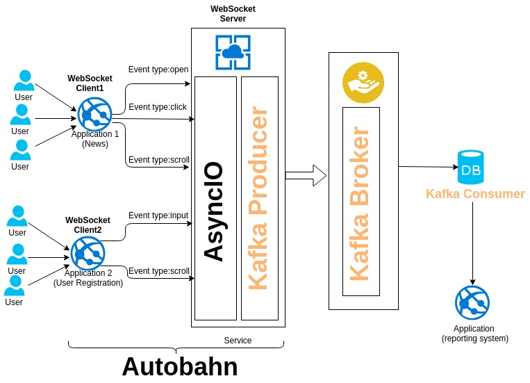

## Tech stack
- Python >3.6
- Kafka
- asyncio
- autobahn https://autobahn.readthedocs.io/en/latest/

## Rationale

Web sockets used to reduce calls to web service. Just one call over HTTP for handshake the connection. Other calls performed via WebSockets, this minimizes calls to service, TCP handshakes and HTTP headers overhead.

Autobahn well-known framework to work with WebSockets on both sides client and server. It has a wide range of supported programming languages. Also, it has high performance and fully asynchronous implementation (via asyncio).

Kafka can be thought as a сentral bus for a heterogeneous system of microservices.

One of the consumers of Kafka is a reporting system (Redshift for example).

All components are Open Source projects. Python very fast for prototyping and asyncio with epoll event poll has high performance. 